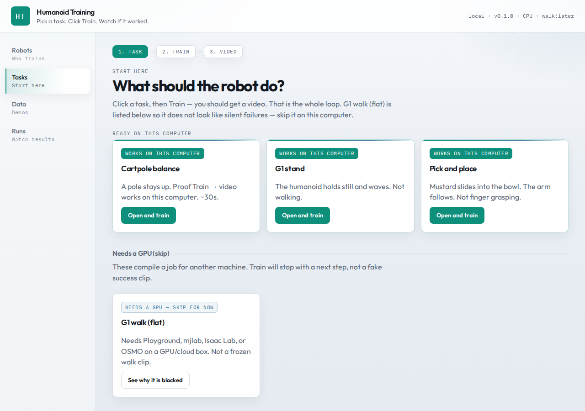
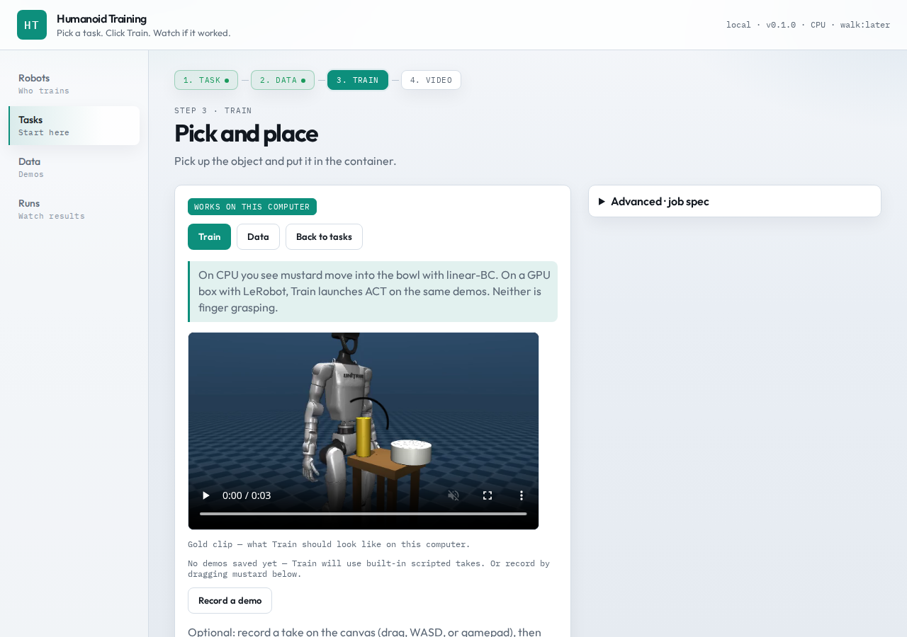
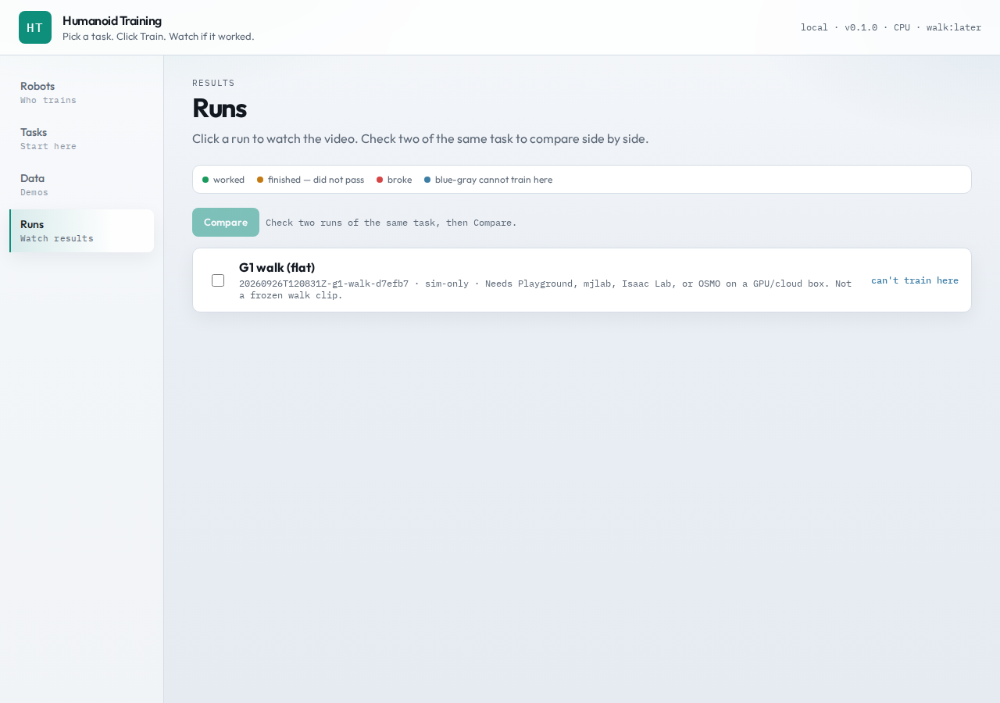

# Humanoid Training

[](https://github.com/notifdust/Humanoid-Training/actions/workflows/tests.yml)
[](https://www.python.org/downloads/)
[](LICENSE)

Studio and compiler for humanoid training jobs on existing engines
([MuJoCo](https://mujoco.org/), [Playground](https://playground.mujoco.org/),
[Isaac Lab](https://developer.nvidia.com/isaac/lab),
[LeRobot](https://github.com/huggingface/lerobot)).

Pick a recipe → train → watch an eval video. The product is the loop, not a new
simulator, policy family, or dataset format.



## Features

- **CPU loop that works today** — Cartpole, Unitree G1 stand, and mustard→bowl
  with checked-in gold videos and CI
- **Honest GPU path** — G1 walk compiles to Playground / mjlab / Isaac Lab;
  blocked cleanly when CUDA is missing (no stand-clip substitution)
- **Job-spec compiler** — recipe expansion → adapter → engine; the UI projects
  run `facts`, it does not hardcode task theater
- **Imitation when ready** — LeRobot demos; ACT on GPU + LeRobot; linear-BC on CPU
- **Fail closed** — deploy, walk proof, and ACT preflights refuse silent success

## Requirements

- Python 3.11+
- Linux recommended (MuJoCo GLFW for eval video)
- Optional: NVIDIA GPU + CUDA 12 for G1 walk (Playground)

## Install

```bash
git clone https://github.com/notifdust/Humanoid-Training.git
cd Humanoid-Training
python3 -m venv .venv
source .venv/bin/activate
pip install -e ".[dev]"
```

On Debian/Ubuntu, use a venv — system `pip` is externally managed. Do not install
the Ubuntu TeX package named `ht`; the project CLI is provided by this package.

## Quick start

```bash
./run-studio.sh
# or: python -m humanoid_training.cli serve --host 127.0.0.1 --port 8000
```

Open [http://127.0.0.1:8000](http://127.0.0.1:8000), select **Cartpole**, click
**Train**, and play the eval video (~30s).



Suggested path on a laptop:

1. **Cartpole** — validates Train → video on this machine
2. **G1 stand** — humanoid hold + wave (not walking)
3. **Pick and place** — mustard into the bowl (not finger grasping)

**G1 walk** requires a GPU (see below). There is no G1 reach recipe.

Studio rooms: Robots · Tasks · Data · Runs. The job spec editor is under Advanced.

## CLI

```bash
python -m humanoid_training.cli recipes
python -m humanoid_training.cli train spec/examples/cartpole-balance.json
python -m humanoid_training.cli fetch-assets unitree_g1
python -m humanoid_training.cli train spec/examples/g1-stand.json
python -m humanoid_training.cli train spec/examples/g1-walk.json --compile-only
python -m humanoid_training.cli train spec/examples/cartpole-balance.json --docker
```

`--docker` runs the Phase 1 CPU image; GPU recipes are refused there.

Headless scoring without writing a video:

```bash
HT_NO_RENDER=1 python -m humanoid_training.cli train spec/examples/cartpole-balance.json
```

Artifacts land in `runs/<id>/` (`eval.mp4`, `manifest.json`).

## G1 walk on GPU (Phase 3c)

Playground currently needs **jax 0.9.x** with a CUDA build. A bare
`pip install playground` can pull an incompatible jax and a CPU-only jaxlib.

```bash
source .venv/bin/activate
pip install -e ".[playground]"
pip install "jax[cuda12]==0.9.2"   # large one-time download; resume if interrupted

python -c "import jax; print(jax.__version__, jax.default_backend())"
# expect: 0.9.2 gpu

python -m humanoid_training.cli proof walk --check
python -m humanoid_training.cli proof walk
```

Successful proof writes `runs/<id>/eval.mp4` and `proof_3c.json`.

If the CUDA wheel download fails mid-way:

```bash
pip install --resume-retries 50 "jax[cuda12]==0.9.2"
```

Without a local GPU, remote harvest (OSMO / Hugging Face Jobs) is Phase 3d —
see [docs/NEXT.md](docs/NEXT.md).

## Recipes

| Recipe | Environment | Notes |
|---|---|---|
| `cartpole-balance` | CPU | Gold clip in-tree |
| `g1-stand` | CPU | Stand + wave; not walking; gold clip |
| `pick-and-place` | CPU BC; ACT if LeRobot+GPU | Mustard→bowl; not grasping |
| `g1-walk` | GPU | Playground / mjlab / Isaac; no gold clip |
| `g1-walk-rough` | GPU | Rough terrain; no gold clip |
| `g1-track` | GPU + `HT_MJLAB_MOTION` | Motion tracking; no gold clip |
| `g1-pickplace` | GPU + Isaac dataset | Locomanipulation PickPlace |
| `g1-pickplace-fixed` | GPU + Isaac dataset | Fixed-base PickPlace |



## Documentation

| Document | Contents |
|---|---|
| [docs/VISION.md](docs/VISION.md) | Product positioning |
| [docs/NEXT.md](docs/NEXT.md) | Mission scorecard and next steps |
| [docs/ROADMAP.md](docs/ROADMAP.md) | Phase exit tests |
| [docs/ARCHITECTURE.md](docs/ARCHITECTURE.md) | Spec, adapters, runners |
| [docs/BETTERMENT.md](docs/BETTERMENT.md) | Completed CPU polish (B0–B5) |
| [CONTRIBUTING.md](CONTRIBUTING.md) | Local development |

## Development

```bash
source .venv/bin/activate
pip install -e ".[dev]"
pytest
# Optional gold retrain (ffmpeg + display or xvfb):
# HT_GOLD=1 xvfb-run -a pytest -m gold
```

## Troubleshooting

| Issue | Resolution |
|---|---|
| `externally-managed-environment` | Create a venv before `pip install` |
| `ht` resolves to a TeX package | Use the project venv; do not apt-install `ht` |
| First G1 stand fails offline | Run `ht fetch-assets unitree_g1` (network once) |
| Train succeeds with no `eval.mp4` | Needs a display or xvfb; `HT_NO_RENDER=1` skips video |
| G1 walk exits 12 on a laptop | Expected without GPU |
| `jax.device_put_replicated` missing | Pin `jax[cuda12]==0.9.2` |
| jax reports CPU despite nvidia-smi | Finish the CUDA wheel install (resume retries) |
| Studio port in use | `HT_PORT=8060 ./run-studio.sh` |

## Non-goals

- New physics engines, policy architectures, or dataset formats
- Competing with LeLab on SO-ARM101
- Fleet operations
- Claiming walk / ACT / remote-harvest success from CPU CI

## License

[MIT](LICENSE) © 2026 Gabriele Sepolvere
